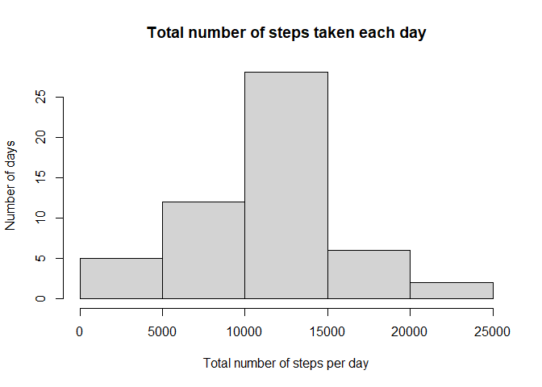
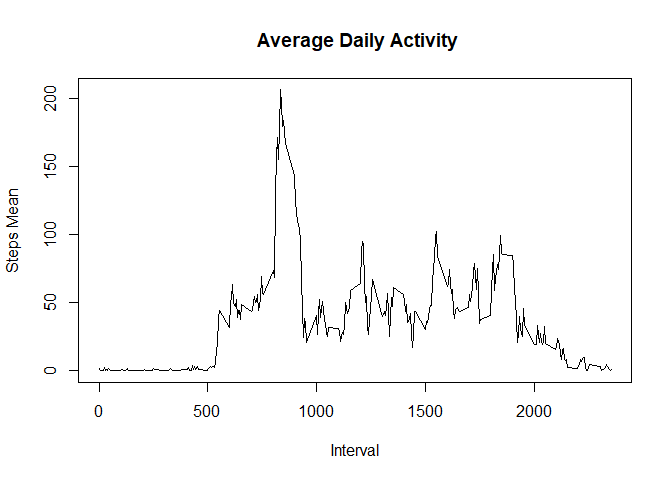
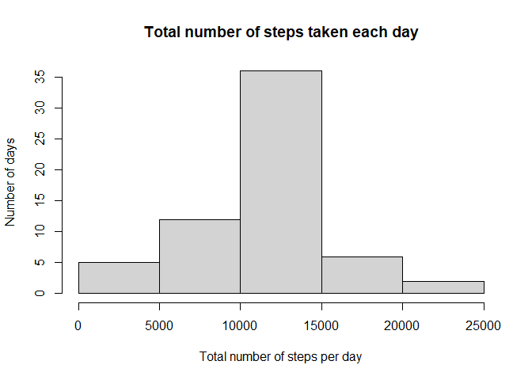
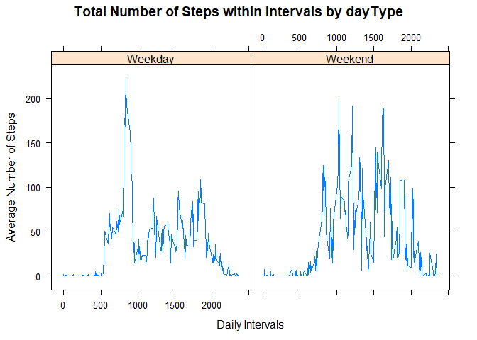

## Loading and preprocessing the data


```r
data <- read.csv("activity.csv")
```

## What is mean total number of steps taken per day?


```r
library(dplyr)
```

```
## Warning: package 'dplyr' was built under R version 4.0.3
```

```
## 
## Attaching package: 'dplyr'
```

```
## The following objects are masked from 'package:stats':
## 
##     filter, lag
```

```
## The following objects are masked from 'package:base':
## 
##     intersect, setdiff, setequal, union
```

```r
datax <- data %>%
     group_by(date) %>%
     summarise_at(vars(-interval), list(sum = sum))
hist(datax$sum,xlab = "Total number of steps per day", ylab = "Number of days", main = "Total number of steps taken each day")
```

<!-- -->

```r
meanx <- mean(datax$sum, na.rm = TRUE)
medianx <- median(datax$sum, na.rm = TRUE)
print(paste("The mean is", meanx), quote = FALSE)
```

```
## [1] The mean is 10766.1886792453
```

```r
print(paste("The median is", medianx), quote = FALSE)
```

```
## [1] The median is 10765
```

## What is the average daily activity pattern?


```r
datay <- data %>%
      group_by(interval) %>%
      summarise_at(vars(-date), list( mean = mean), na.rm = TRUE)
with(datay, plot(interval,mean, type = "l", ylab = "Steps Mean", xlab = "Interval", main = " Average Daily Activity"))
```

<!-- -->

## Imputing missing values

```r
nacount <- sum(is.na(data$steps))
print(paste("There are",nacount, "NA values"), quote = FALSE)
```

```
## [1] There are 2304 NA values
```
I chose to replace the NA values with the mean of the steps column (Every day,
Every interval)


```r
data2 <- data
data2[is.na(data2[,1]),1]<-mean(data2[,1], na.rm=TRUE)
dataw <- data2 %>%
     group_by(date) %>%
     summarise_at(vars(-interval), list(sum = sum))
hist(dataw$sum,xlab = "Total number of steps per day", ylab = "Number of days", main = "Total number of steps taken each day")
```

<!-- -->

```r
meanw <- mean(dataw$sum, na.rm = TRUE)
medianw <- median(dataw$sum, na.rm = TRUE)
print(paste("The mean is", meanw), quote = FALSE)
```

```
## [1] The mean is 10766.1886792453
```

```r
print(paste("The median is", medianw), quote = FALSE)
```

```
## [1] The median is 10766.1886792453
```

The impact of the change can be seen on the histogram, the frequency of total number
of days between 10.000 and 15.000 has increased greatly. Also, the median and the
mean is now the same, due to the change.

## Are there differences in activity patterns between weekdays and weekends?


```r
library(lattice)
data$date<-as.Date(data$date)
data3 <- data %>%
        mutate(Day = ifelse(weekdays(data$date)=="sabado" |            weekdays(data$date)=="domingo", "Weekend", "Weekday"))
datav <- data3 %>%
      group_by(interval, Day) %>%
      summarise_at(vars(-date), list( mean = mean), na.rm = TRUE)
with(datav, xyplot(mean ~ interval | Day, type = "l", main = "Total Number of Steps within Intervals by dayType",xlab = "Daily Intervals", ylab = "Average Number of Steps"))
```

<!-- -->

